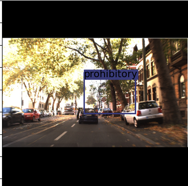
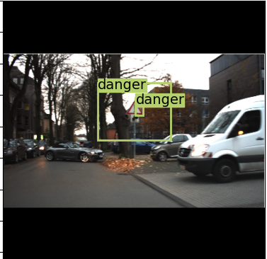

# RetinaNet implementation

### Hello all!

In this repository I played around with RetinaNet and implemented it for object detection of traffic signs.
The data can be found here: https://www.kaggle.com/datasets/valentynsichkar/traffic-signs-dataset-in-yolo-format

### Architecture
I based the repo on this paper: https://arxiv.org/pdf/1708.02002.pdf 
The authors use a FPN combined with a focal loss to tackle the class imbalance. 
They use a ResNet50 backbone and put a regression and classifciation head on top of the backbone.

----
For my implementation I used a ResNet34 backbone due to GPU memory issues. Additionally, I used the anchor offset 
computation proposed in the Yolov3 paper by: 
- Center Coordinates:
    $$\[ b_x = \sigma(t_x) + c_x \]$$
    $$\[ b_y = \sigma(t_y) + c_y \]$$
  - Width and Height:
    $$\[ b_w = p_w \cdot e^{t_w} \]$$
    $$\[ b_h = p_h \cdot e^{t_h} \]$$

This stabled my gradients. I trained for a couple of epochs and was able to detect the correct objects.
Unfortunately, the bounding boxes are not that accurate yet. here is an example:

----
There is still room for improvement. NMS has to be applied and the bounding box predictions can be more accurate. 
My class accuracy is around 75% and no object accuracy is about 99%, which is already decent considering I trained only a couple hundred epochs with this small dataset.
MAP is around 50% with a threshold of 0.3.
